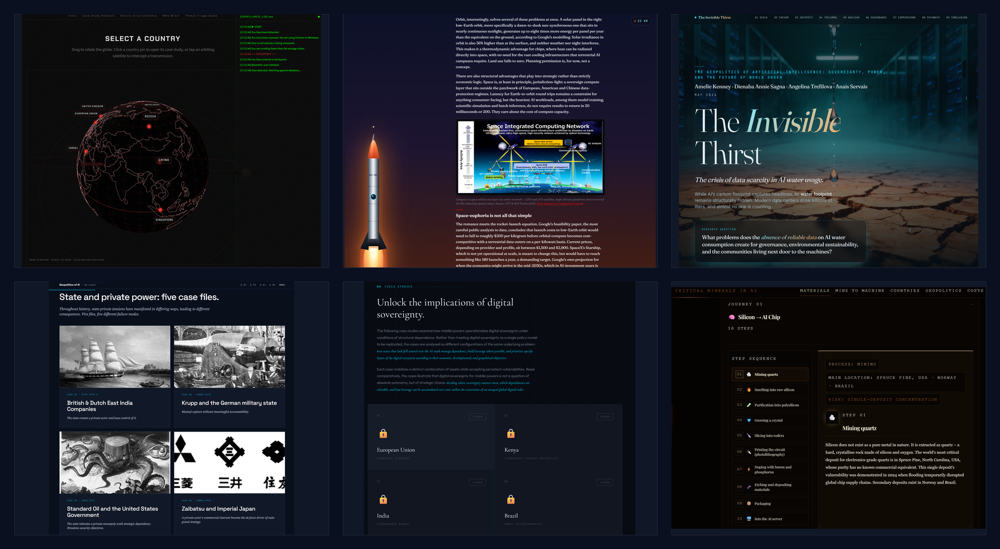
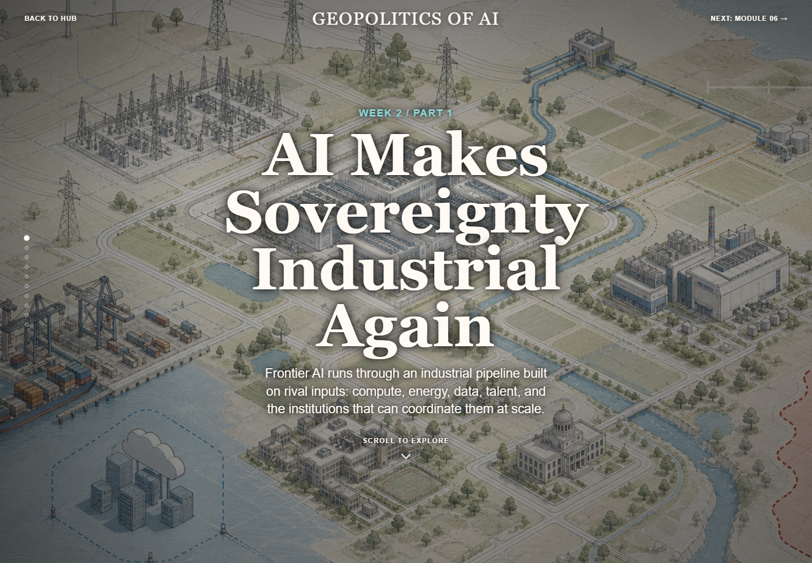

# Geopolitics of AI: Sovereignty, Power, and the Future of World Order
**Sciences Po Paris - Spring 2026**

Live site: [geopoliticsofai.org](https://geopoliticsofai.org)

This repository hosts the public platform for *Geopolitics of AI*, a Sciences Po seminar taught by Adrien Abecassis and Alexandre Mirlesse, on how artificial intelligence is changing the conditions of political power. The course treats AI not only as a family of models or applications, but as a geopolitical system: compute, energy, chips, data, firms, states, infrastructures, laws, and strategic narratives.

Visitors can move through interactive teaching modules and enter the final student projects as standalone web essays. The website turns that course architecture into a public, navigable atlas of AI geopolitics as it appears in practice: frontier firms, state capacity, industrial policy, water scarcity, digital dependence, surveillance, space-based compute, and critical mineral supply chains.


## Student Research Projects

The centerpiece of the platform is the students' final work.

Each project is a self-contained web experience, with its own design, narrative structure, and analytical approach to a live problem in AI geopolitics: material systems, environmental pressures, legal regimes, industrial dependencies, military power, corporate strategy, and state sovereignty. Students selected the topics, built the research base, shaped the argument, and translated that argument into a web experience with its own visual and analytical logic.

The quality of the work is remarkable. The projects are deliberately varied: some use scenario analysis, some foreground infrastructure, some build visual explainers, and others work through policy tradeoffs or historical comparison. Together, they show the range of ways AI geopolitics can be studied and presented.



The six projects are:

- **Group 1: AI & State Surveillance**
  How AI-enabled surveillance reshapes state capacity, civil liberties, and democratic oversight.

- **Group 2: The Next Frontier of AI Isn't a Model. It's an Orbit.**
  Orbital data centers, space law, and the geopolitics of moving compute beyond Earth.

- **Group 3: The Invisible Thirst**
  AI data centers, water scarcity, and the missing facility-level data that weakens environmental governance.

- **Group 4: Downstream of the Frontier**
  AI as a privately held frontier technology and national-security asset, read through historical analogies of state-private power.

- **Group 5: Digital Sovereignty in the Age of Dependence**
  How middle powers manage digital dependence across compute, energy, data, talent, regulation, and infrastructure.

- **Group 6: Critical Minerals in AI**
  The rare earths, metals, and supply chains that make artificial intelligence materially possible.

## Course Modules

The student projects sit alongside eight interactive course modules. These modules provide the shared conceptual and historical frame for the seminar, moving from the politics of the early internet to the emerging order around AI.

1. **The Utopian Dawn** - the liberal dream that cyberspace would dissolve borders.
2. **The Rebuttal** - China's sovereign internet model and the architecture of control.
3. **The Rupture** - Snowden, surveillance, and the collapse of trust in digital infrastructure.
4. **The Splinternet Accelerates** - the fragmentation of the open web into rival stacks.
5. **Industrial Sovereignty** - compute, energy, chips, and the return of production constraints.
6. **National Revival Through Tech** - techno-nationalism and industrial policy as statecraft.
7. **New Ideological Map of AI** - competing worldviews shaping AI politics.
8. **The Collision of Frames** - the governance tradeoffs that will structure the next order.



## How the Platform Works

The landing page is a 3D knowledge hub. Anchor nodes represent course modules; satellite nodes represent student research projects. Visitors can move through the graph, open modules, and enter each project directly. A magazine-style text view is also available for readers who prefer a more linear entry point.

Technically, each student project lives in its own isolated folder under `projects/group-X/`. This structure gave each group creative freedom while keeping the main platform stable. The repository therefore preserves both the shared course architecture and the individuality of the student work.

## Repository Structure

```text
.
|-- index.html              # 3D course hub
|-- magazine.html           # magazine-style index
|-- primer/                 # eight course modules
|-- projects/               # student project sandboxes
|   |-- group-1/
|   |-- group-2/
|   |-- group-3/
|   |-- group-4/
|   |-- group-5/
|   `-- group-6/
|-- shared/                 # shared hub/runtime code
|-- assets/                 # course media and README screenshots
`-- tests/                  # validation and smoke tests
```

---

## Instructions for Students: Publishing Your Group Project

For your final evaluation (30% of your grade), your group is required to build a static webpage that explains a complex AI geopolitics topic of your choice. You will not write the code by hand; you will manage an AI agent to write it for you. Your job is to provide the high-quality intelligence (the text, the analysis, the data); the AI's job is to build the container (the webpage).

Because this repository separates the main site from the student folders, your code is isolated. You have total creative and technical freedom over how you build your page, as long as it fits in the repository architecture without breaking the main website.

### Step 1: Find Your Sandbox
Navigate to the `projects/` directory in this repository. You will see 6 folders:
- `/projects/group-1/`
- `/projects/group-2/`
- `/projects/group-3/`
- `/projects/group-4/`
- `/projects/group-5/`
- `/projects/group-6/`

Your group has been assigned one of these folders. **You must place your published files within your assigned folder.**

### Step 2: Choose Your Path

We recognize that students have varying levels of technical comfort. Choose the path that fits your group's level.

#### Option A: "Copy and Paste" method (Zero Technical)
If your group has no coding experience, use frontier chatbots to generate your site:
1. Write the substance in any format (Google Doc, Word, plain text).
2. Ask an AI (Claude, ChatGPT, Gemini) to convert it into a static webpage that matches the vibe of your analysis.
3. Save the output with `index.html` as the entry file. Extra local CSS, JS, images, or fonts are allowed if they stay inside your assigned group folder.
4. Share the files with the teachers, and we will publish them to your folder on the live server for you.

#### Option B: "Builder" method (Light to Advanced Technical)
If your group wants to use AI coding agents (VS Code with Gemini, Codex, Claude) or vibe-coding tools (Antigravity, Claude Code), you have full freedom to do so:
1. Create a GitHub account.
2. **Fork** this repository on GitHub, then clone your fork locally.
3. Use your AI tools to build your project. **Important:** Your final output must compile to static files. If you use a framework, run your build command (for example, `npm run build`) and copy the contents of your `dist/` or `out/` folder into your assigned group folder. Ensure asset paths are relative and remain inside that folder.
4. Push a branch to your fork and open a Pull Request into `AABK6/geopolitics-ai-scpo-hub`.

Most students should use the fork-and-PR flow below. Pushing directly to `main` will fail unless you have explicitly been given write access to the upstream repository.

To push your project to the Hub via GitHub:
```bash
# 1. Fork the repository on GitHub, then clone your fork
git clone https://github.com/YOUR_GITHUB_USERNAME/geopolitics-ai-scpo-hub.git
cd geopolitics-ai-scpo-hub

# 2. Create a working branch
git checkout -b add-group-1-project

# 3. Add your files to your specific group folder
# (for example, copy your built static files into projects/group-1/)

# 4. Stage and commit your changes
git add projects/group-1/
git commit -m "Add Group 1 Project"

# 5. Push your branch to your fork
git push -u origin add-group-1-project
```

Then open a Pull Request from your forked branch into `AABK6/geopolitics-ai-scpo-hub:main`.

Within 60 seconds of merging, GitHub Pages will rebuild the site. Your research project will automatically become accessible via the 3D Hub as a Satellite Node.

### Architecture Rules
- **Do not edit files outside your `projects/group-X/` folder.** Student Pull Requests are validated automatically and will be rejected if they change `shared/`, `primer/`, root files, workflow files, or another group's folder.
- **Your entry file must be named `index.html`.** The Hub's router specifically looks for `projects/group-X/index.html` to load your project.
- **Your bundle must be self-contained.** Local assets must resolve from inside your assigned folder. Do not reference `../`, `/shared/`, `/primer/`, or another group's files.
- **Only submit static output.** Do not include `package.json`, lockfiles, TypeScript or JSX source, server-side code, or other build-time artifacts in the published folder.
- **Substance over flash:** A beautiful site with shallow analysis will get a lower grade than a simpler site with deep, verified geopolitical insight.

### Review and Publishing
- **Students submit by Pull Request.** Direct pushes to `main` are reserved for teachers and maintainers.
- **Teachers can still publish files for you.** If you choose Option A, you can send your files directly to the teaching team and we will handle the upload.

---

## Local Development (For checking your work)
If you are using Option B and want to view the entire Hub locally to see how your project integrates:

1. Open your terminal and navigate to the repository root.
2. Run a local Python server:
   ```bash
   python3 -m http.server 8000
   ```
3. Open `http://localhost:8000` in your browser.
